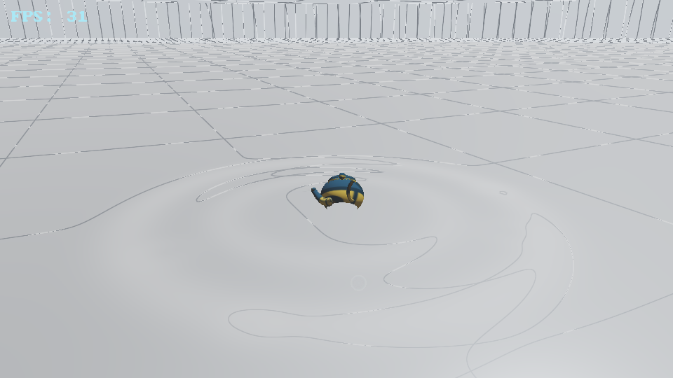

# ElectroBench
ElectroBench is a 45+60+45 second long triple scene benchmark specifiacally designed to run on old and modern PCs, don't critise it by it using OpenGL 2.1, and GLSL 1.2, Even office PCs have low scores at it.
It uses OpenGL 2.1/3.3, and C++, and uses make for compilation. It is designed to be a replacement for glmark (even though it is great and I used it before).

It ships **one** executable that contains **all three** scenes — no second binary, no child process:

| Scene | Renderer | Contents |
|---|---|---|
| **ElectroBench** (the OG) | OpenGL 2.1 / GLSL 1.2, fixed-function pipeline | **110 UZIs** on a shadow-mapped concrete floor, lit by a warm sun |
| **TideBench** (scene 2) | OpenGL 3.3 core, pixel-shader workloads | An ocean under volumetric clouds (3DMark2001 SE "Nature" recreation) |
| **PoolBench** (scene 3) | OpenGL 3.3 core, analytic shaders | A white-and-red checkerboard-sky pool room with a hidden light and two waves of falling, splashing teapots (18 total) |


# Screenshots

The 110 UZIs lying on the shadow-mapped concrete floor — every gun casts its own compact shadow anchored at its contact point (warm sun from the upper left):


Close-up — mags resting on the ground, shadows clearly visible under each gun:


The TideBench ocean scene — long cloud banks with sunward silver linings, a narrow orange glitter path down the middle of the sea, dark blue-purple water either side, raised swell banks:


The PoolBench pool room — an infinite white-and-red checkerboard sky mirrored on open water, lit only by a hidden light, with two waves of teapots raining down in scattered positions, splashing on impact and bobbing to rest:



# How to build ?

Dependencies : `make`, `g++`, SDL2, GLEW, GLU (+ dev headers). On Debian/Ubuntu that is
`libsdl2-dev libglew-dev libglu1-mesa-dev`; on Windows use MSYS2 (`pacman -S mingw-w64-x86_64-{gcc,SDL2,glew}`); on macOS `brew install sdl2 glew` (you may need `brew install make` for a GNU make).

```sh
make            # builds the single ElectroBench binary (all three scenes linked in)
make run        # builds it and runs it
```

The one binary lands in `build/` :

```sh
./build/ElectroBench          # Linux / macOS
./build/ElectroBench.exe      # Windows (MSYS2)
```

## Static build

Pass `STATIC=1` to link everything statically (`-static -static-libgcc -static-libstdc++` + static
dependency archives) — handy for dropping a single exe on old machines:

```sh
make STATIC=1            # -> build/ElectroBench-static(.exe)
```

This requires the **static archives** of every dependency (e.g. MSYS2's `mingw-w64-x86_64-SDL2` ships
`libSDL2.a` already; on Linux you need the `.a` variants of SDL2/GLEW/GLU installed). On Windows the
static build also defines `GLEW_STATIC` and uses the static GLEW archive, so its link line is
`-static-libgcc -static-libstdc++ -lopengl32 -lglu32 -lSDL2main -lSDL2 -mwindows` (plus the
`pkg-config --static` dependency flags) — no DLLs are needed next to the exe. The static build keeps
its objects under `build/static/`, separate from the normal DLL-linked objects.

# The OG GL 2.1 benchmark (110 UZIs)

Renders **110 UZIs** (10×11 grid) on a shadow-mapped concrete floor through the fixed-function
pipeline, exactly like a 2001-era title: per-gun compact shadows anchored at each contact point,
a warm directional sun, and a real-time **FPS + score HUD** drawn in a 5×7 bitmap font.

Controls : long-click + move orbits the camera, mouse wheel zooms (smooth, clamped so you never clip
into the scene), `ESC` quits. The FPS counter is a true frame-count average (SDL performance counter,
every frame accounted) — the on-screen value is a smoothed window, the final score uses **all** frames
of the run.

# Scene 2 — TideBench

TideBench is **scene 2 of the same ElectroBench binary** and is written in **OpenGL 3.3 core**.
It pushes a heavy, realistic ocean workload —
high-resolution environment reflections, a dense displaced ocean mesh, and a real volumetric
light-transport model for the clouds. It is heavy **on purpose**: the goal is to push old and new
hardware alike, so low single-digit FPS on a low-end machine means the workload is doing its job.

What it renders :
- A procedural **sky dome** rendered **directly at full screen resolution**: dusk gradient with a
  bright horizon band, a compact orange sun, and seven **volumetric cloud banks**. Each bank combines
  eight anisotropic 3D lobes with low-frequency boundary erosion, then integrates seven density probes
  toward the sun through three energy-conserving scattering octaves. This produces layered cauliflower
  silhouettes, thin silver linings, warm transmission through shoulders, cool dense bases, powdery
  cores, and aerial perspective without sampling a cloud texture. Hand-placed banks preserve exact
  clear-sky gaps instead of producing noise-texture mottle
- A **4 km ocean patch** on a dense GPU-displaced grid: long rolling swells with crest-skewed banks,
  per-pixel analytic wave normals plus near-camera detail wavelets
- High-resolution **environment cubemap** reflections with roughness-matched LOD (the sun smears
  into a glow, never texel squares), fresnel blending, sun-tinted **glitter** path gated to the
  sun's azimuth (bright path down the middle, dark blue-purple water either side),
  slope-gated crest foam, sun-path-gated subsurface glow in thin crests, and distance haze that converges into the
  actual per-azimuth sky colour so the far sea melts into the horizon
- **Cloud shadows on the water**: each sea fragment is projected along its sun ray into the same 620 m
  cloud deck and matched 3D-lobe density field the sky renders — where a cloud blocks the sun the
  direct light dies, foam stops breaking and the sea goes much darker, in coherent moving patches that
  sit exactly under the clouds that cast them. Off-sun water sinks to near-black indigo
- A clean in-engine **FPS readout** (the score belongs to the final results line) and the same score
  formula as the main benchmark, over a 45 second run

Run the ocean scene on its own with :

```sh
make
./build/ElectroBench --scene-only          # Linux / macOS
./build/ElectroBench.exe --scene-only      # Windows (MSYS2)
```

Controls : `F` toggles the automatic fly-over camera, long-click + move orbits the camera, mouse wheel zooms, arrow keys look around, `ESC` quits.

# Scene 3 — PoolBench

PoolBench is **scene 3 of the same ElectroBench binary**, also **OpenGL 3.3 core**. It is the
pool-room illusion: an infinite checkerboard ceiling-sky mirrored perfectly on open water.

What it renders :
- A **checkerboard sky dome** with analytically antialiased tiles that project to the horizon, and a
  soft directional wash toward a **hidden light source** — there is no sun disc, no lamp model:
  the light is only ever visible through the shading it produces
- **Open water** that analytically mirrors the same checker function the sky uses, so the reflection
  lines up with the sky across the horizon, plus fresnel dimming, distance haze and foam brightening
- **Two waves of teapots** — 18 in total (the real Utah teapot, `assets/teapot.obj`, one material,
  placeholder texture you can swap). Wave one rains down over the first ten seconds; wave two opens
  up on the pool's outer ring from ~11 s. Each pot has scattered positions, sizes and drop heights
  on a staggered timeline, with real-ish physics: gravity and tumble in the air, splash with
  rebound on impact, buoyancy + drag underwater, then a damped bob to rest while it slowly rights
  itself. `R` re-drops the whole fleet
- **Splash FX**: a GPU-animated **Worthington crown** — a water sheet that erupts around the impact,
  reflects and transmits the checker tiles through it, and tears into alpha-striped **fingers** as
  it disintegrates — plus ballistic **droplet streaks** stretched along their velocity (wave-two
  impacts throw double ejecta with torn sheet fragments), expanding **ripple rings** that disturb
  the reflection, and the delayed central **Rayleigh jet** — its punch scaled by the impact — that
  fires on the cavity's inertial collapse and falls back with its own ring. All CPU cost is a
  handful of uniforms; the geometry animates in the vertex shader

Run the pool scene on its own with :

```sh
make
./build/ElectroBench --pool-only          # Linux / macOS
./build/ElectroBench.exe --pool-only      # Windows (MSYS2)
```

Controls : `F` toggles the automatic camera, long-click + move orbits, mouse wheel zooms, `R` re-drops
the whole fleet, `ESC` quits.

Headless visual-test flags (used to verify the render output in CI-like environments):

```sh
./build/ElectroBench --scene-only --width 960 --screenshot /tmp/shot.ppm --shot-times 6,20,38
./build/ElectroBench --pool-only --width 960 --screenshot /tmp/shot.ppm --shot-times 2,3.2,5,12
./build/ElectroBench --og-only --screenshot /tmp/shot.ppm --shot-time 3
```

# How the score is calculated ?

All scenes use the same formula, computed from the **average FPS over the whole run**:

```
score = fps² × 2
```

It is linear in nothing: twice the frames means twice the score, twice the load means a quarter of
it — a fair curve from office PCs to gaming rigs. The binary prints
`Time / Average FPS / Score` at the end, and the OG scene also shows live FPS + score in its HUD.

# The results screen

When a scene's 45/60 second run ends, **the benchmark clears the window and prints that scene's
score on screen** — a big centred score with the time and average FPS underneath — and leaves it
up for a few seconds (the final combined screen for about ten, or until you press `ESC`).
The same line is also printed to stdout.

```sh
Benchmark Results - Time : 45.0s, Average FPS : 12.4, Score : 308
```

# One executable, three scenes

`build/ElectroBench` is the **only** binary, and it contains all three scenes. It runs the OG 60-second gun scene
first, then probes an OpenGL 3.3 core context:

- **found** — TideBench runs as scene 2, then PoolBench as scene 3, on the same session, and the final
  results screen shows **per-scene scores and the average of the scenes that ran**
- **not found** (GL 2.1-only drivers, old iGPUs) — both GL 3.3 scenes skip themselves cleanly and the
  OG result stands, so the binary still runs on the ancient hardware it targets

Scene selection flags: `--og-only` runs just the gun scene even on GL 3.3-capable devices,
`--scene-only` runs just the ocean scene, `--pool-only` runs just the pool-room scene.

# Windows (MSYS2)

On Windows the easiest route is [MSYS2](https://www.msys2.org/), which provides gcc, cmake and prebuilt SDL2/GLEW/GLU packages. The single binary builds and runs unmodified.

**1. Install MSYS2** from [msys2.org](https://www.msys2.org/) to the default `C:\msys64`.

**2. Run:**

```sh
g++ -std=c++17 -O2 -march=x86-64 -mtune=generic \
    src/main.cxx \
    src/tidebench.cxx \
    src/pool.cxx \
    -o build/ElectroBench.exe \
    $(pkg-config --cflags --libs sdl2) \
    -lglew32 \
    -lglu32 \
    -lopengl32
```

All three scenes are linked into that one binary: `src/tidebench.cxx` and `src/pool.cxx` are scene
modules (they have no `main()` of their own) that `src/main.cxx` hands the same SDL session to. For
the static build, prefer
`make STATIC=1`: it passes `-DGLEW_STATIC`, uses `pkg-config --static`, and keeps the static object
files separate from the normal build. If invoking `g++` directly, use the same define and static
GLEW archive consistently; do not compile with the DLL-import GLEW header and then link
`libglew32.a`.

Notes for the direct g++ build :
- `-march=x86-64 -mtune=generic` is the key: it emits baseline x86-64 code that runs on any 64-bit CPU, so the resulting exe won't illegal-instruction even where the prebuilt MSYS2 tools do.
- Keep `-lglew32` before `-lSDL2`, and `-lopengl32` last — link order matters on MinGW.
- Run the exe from the repo root (or copy `SDL2.dll` / `glew32.dll` from `C:\msys64\<env>\bin` next to it) so the DLLs resolve.
- This was verified end-to-end on a Toshiba Satellite P200 (Core 2 Duo, pre-x86-64-v2) — all three shader programs compiled and linked on hardware.

Notes :
- The headless screenshot flags work too — just use a Windows-style path: `./build/ElectroBench.exe --scene-only --width 960 --screenshot shot.ppm --shot-times 6,20,38`
- Any GPU with drivers from ~2010 onward handles both scenes (the ocean scene needs GL 3.3; the gun scene's GL 2.1 request gets a compatibility context — drivers ignore the profile hint below 3.2, per spec).
- Run the exe from the repo root or via `build\...` — the asset resolver checks the current directory and then the executable's parent, so `shaders/` and `assets/UZI.obj` are found either way.

# Contributions

Contributions are welcome, just post a PR / issue.

**PS** : Sorry guys there are some heavy files I used to fix my tablet, until they're hosted in another repo they'll stay stuck here. :( (nvm when you clone only a symlink exists not the 3.6gb files cus it's LFS files)

# Donating

Send me in my email or post an issue : ayoubprogramming96@outlook.com
