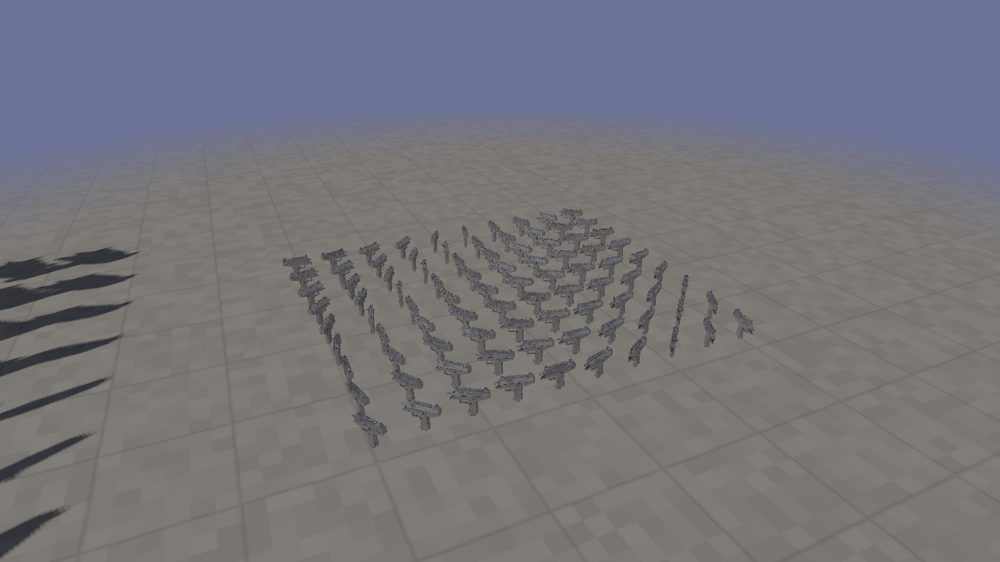
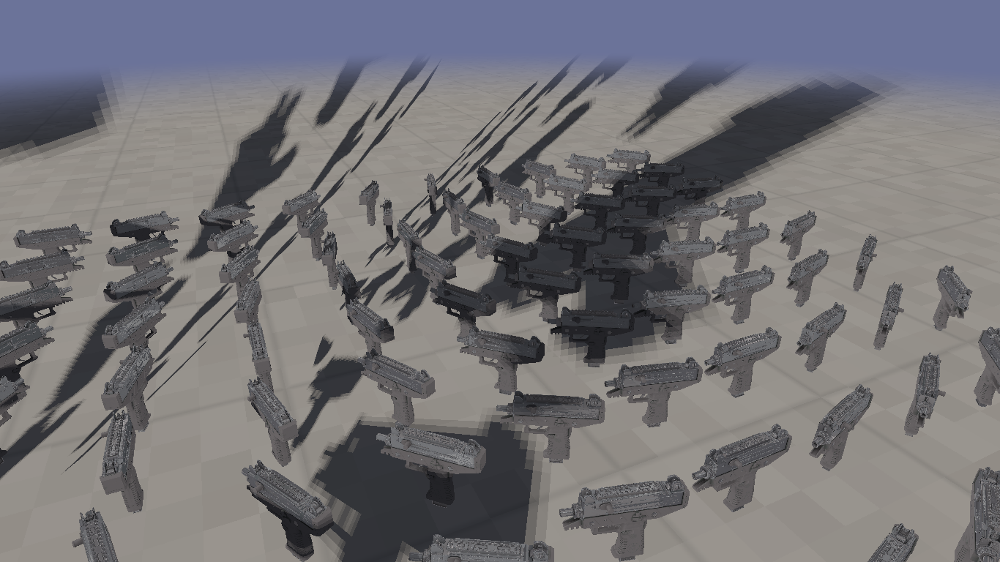
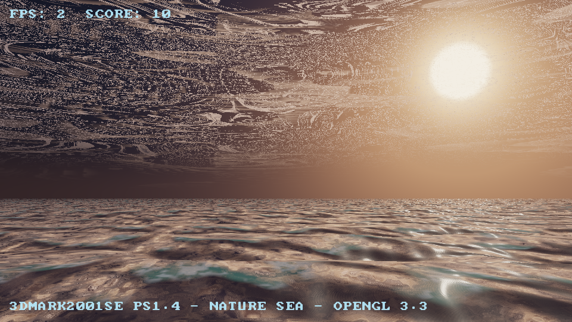

# ElectroBench
ElectroBench is a 45-second long benchmark specifiacally designed to run on old and modern PCs, don't critise it by it using OpenGL 2.1, and GLSL 1.2, Even office PCs have low scores at it.
It uses OpenGL 2.1/3.3, and C++, and uses make for compilation. It is designed to be a replacement for glmark (even though it is great and I used it before).


# Screenshots

The 90 UZIs lying on the shadow-mapped concrete floor — every gun now casts its own compact shadow anchored at its contact point (warm sun from the upper left):



Close-up — mags resting on the ground, shadows clearly visible under each gun:



# PS1.4 Sea benchmark (3DMark2001 SE "Nature" recreation)

The `ps14-sea-benchmark` branch adds a second, heavier benchmark written in **OpenGL 3.3 core** that recreates the pixel shader 1.4 workload from 3DMark2001 SE: an ocean under a cloudy sky with real-time reflections.

What it renders :
- A procedural **sky dome** with big smooth dusk cloud banks, rendered **directly at full screen resolution** — plus a cubemap capture of the same sky used for the sea's reflections (low-res there is invisible and cheap)
- A **4 km ocean patch** (far plane 6000) displaced on the GPU by a 6-octave wave function, haze-matched to the per-azimuth horizon colour so it melts into the sky
- Water shading structured like an asm `ps_1_4` shader: ripple-gradient **addressing** phase, a **dependent read** into the environment cubemap for reflections, then fresnel blending, sun **glitter**, foam crests and distance haze
- The same score formula as the main benchmark, over a 45 second run

Build and run it with :

```sh
make
./build/PS14SeaBenchmark          # Linux / macOS
./build/PS14SeaBenchmark.exe      # Windows (MSYS2)
```

Controls : `F` toggles the automatic fly-over camera, long-click + move orbits the camera, mouse wheel zooms, arrow keys look around, `ESC` quits.

Headless visual-test flags (used to verify the render output in CI-like environments):

```sh
./build/PS14SeaBenchmark --width 960 --screenshot /tmp/shot.ppm --shot-times 6,20,38
```

The sunset scene at 35s into the run (big cloud banks, warm sun with glitter reflection, dark sea haze-matched into the horizon):



# How the score is calculated ?
The score is calculated using this formula : ```fps*2/(1.01/fps)```

# How to run ?

Make sure you have `cmake, glew, libglvnd-dev, sdl2 and glu` installed and then run the following
command on your machine after cloning repo:


```sh
make legacy
```

Controls (original GL 2.1 benchmark) : long-click + move orbits the camera, mouse wheel zooms (smooth, clamped so you never clip into the scene), `ESC` quits. The 90 UZIs stand on a shadow-mapped concrete floor lit by a warm sun.

# Windows (MSYS2)

On Windows the easiest route is [MSYS2](https://www.msys2.org/), which provides gcc, cmake and prebuilt SDL2/GLEW/GLU packages. Both benchmarks build and run unmodified.

**1. Install MSYS2** from [msys2.org](https://www.msys2.org/) to the default `C:\msys64`.

**2. Open the UCRT64 shell** — from the Start menu pick **"MSYS2 UCRT64"** (pink/flamingo icon). Not "MSYS2 MSYS" (black icon): that's the wrong environment and the packages below won't be found.

**3. Update pacman (first launch only)** — run twice if it asks to close the window:

```sh
pacman -Syu
```

**4. Install toolchain + libraries** (one command; if you prefer the MINGW64 shell instead of UCRT64, replace `ucrt-x86_64` with `x86_64` in every name — but stick to one and stay in the matching shell):

```sh
pacman -S --needed git mingw-w64-ucrt-x86_64-gcc mingw-w64-ucrt-x86_64-cmake \
  mingw-w64-ucrt-x86_64-ninja mingw-w64-ucrt-x86_64-pkgconf \
  mingw-w64-ucrt-x86_64-SDL2 mingw-w64-ucrt-x86_64-glew mingw-w64-ucrt-x86_64-glu
```

**5. Clone and build** (Ninja is much faster than the default MinGW generator):

```sh
git clone https://github.com/deadbeef7/ElectroBench.git
cd ElectroBench
cmake -S . -B build -G Ninja
cmake --build build
```

**6. Run** — from the same UCRT64 shell:

```sh
./build/ElectroBench.exe        # original GL 2.1 / GLSL 1.2 — 90 UZIs + shadows
./build/ElectroBenchPS14.exe    # GL 3.3 — the PS1.4 dusk sea benchmark
```

Running from the shell matters: the SDL2/GLEW/GLU DLLs live in `C:\msys64\ucrt64\bin`, which is only on `PATH` inside that shell. To launch from Explorer instead, copy `SDL2.dll`, `glew32.dll`, `glu32.dll` (and `zlib1.dll` if it complains) next to the exe.

**If `cmake` dies with `Illegal instruction`** — modern MSYS2 `mingw64`/`ucrt64` packages (including `cmake.exe` itself) are built for the x86-64-v2 microarchitecture (SSE4.2 + POPCNT), so they crash on older CPUs that lack those instructions (e.g. Core 2 Duo era laptops). If that happens, skip CMake entirely and build directly with g++, which the compiler will happily target at the baseline ISA:

```sh
g++ -std=c++17 -O2 -march=x86-64 -mtune=generic \
    src/main.cxx \
    -o build/ElectroBench.exe \
    $(pkg-config --cflags --libs sdl2) \
    -lglew32 \
    -lglu32 \
    -lopengl32

# PS1.4 sea benchmark (GL 3.3, no GLU needed)
g++ -std=c++17 -O2 -march=x86-64 -mtune=generic \
    src/ps14_bench.cxx \
    -o build/ElectroBenchPS14.exe \
    $(pkg-config --cflags --libs sdl2) \
    -lglew32 \
    -lopengl32
```

Notes for the direct g++ build :
- `-march=x86-64 -mtune=generic` is the key: it emits baseline x86-64 code that runs on any 64-bit CPU, so the resulting exe won't illegal-instruction even where the prebuilt MSYS2 tools do.
- Keep `-lglew32` before `-lSDL2`, and `-lopengl32` last — link order matters on MinGW.
- Run the exe from the repo root (or copy `SDL2.dll` / `glew32.dll` from `C:\msys64\<env>\bin` next to it) so the DLLs resolve.
- This was verified end-to-end on a Toshiba Satellite P200 (Core 2 Duo, pre-x86-64-v2) — all three shader programs compiled and linked on hardware.

Notes :
- The headless screenshot flags work too — just use a Windows-style path: `./build/ElectroBenchPS14.exe --width 960 --screenshot shot.ppm --shot-times 6,20,38`
- Any GPU with drivers from ~2010 onward handles both targets (PS14 needs GL 3.3; the main bench's GL 2.1 request gets a compatibility context — drivers ignore the profile hint below 3.2, per spec).
- Run the exes from the repo root or via `build\...` — the asset resolver checks the current directory and then the executable's parent, so `shaders/` and `assets/UZI.obj` are found either way.

# Contributions

Contributions are welcome, just post a PR / issue.

**PS** : Sorry guys there are some heavy files I used to fix my tablet, until they're hosted in another repo they'll stay stuck here. :( (nvm when you clone only a symlink exists not the 3.6gb files cus it's LFS files)

# Donating

Send me in my email or post an issue : ayoubprogramming96@outlook.com
