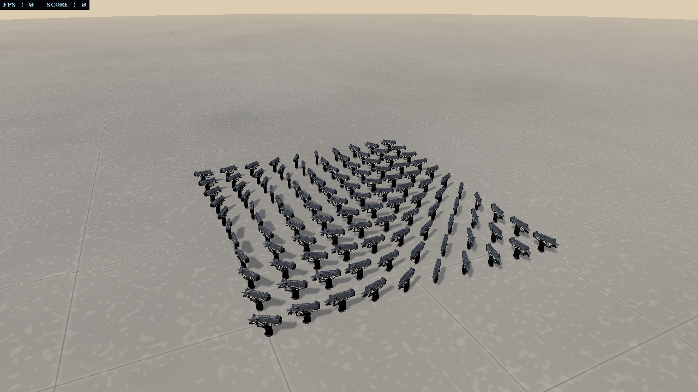
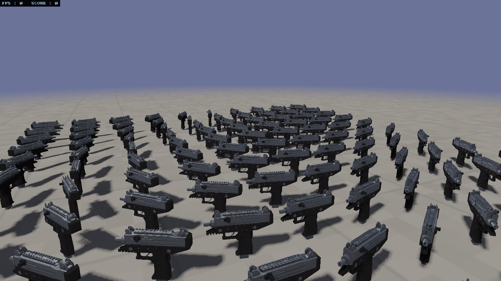
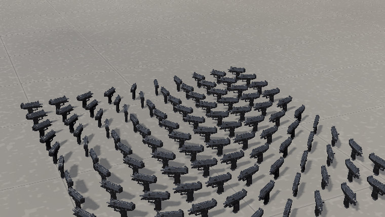
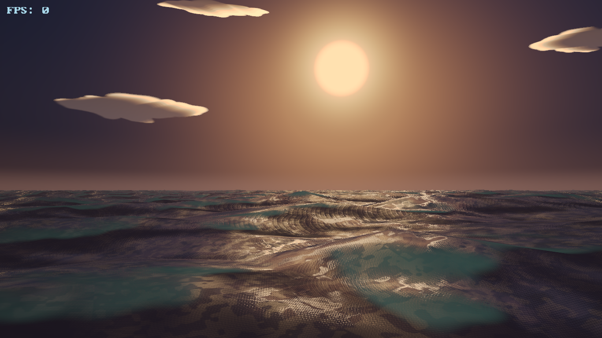
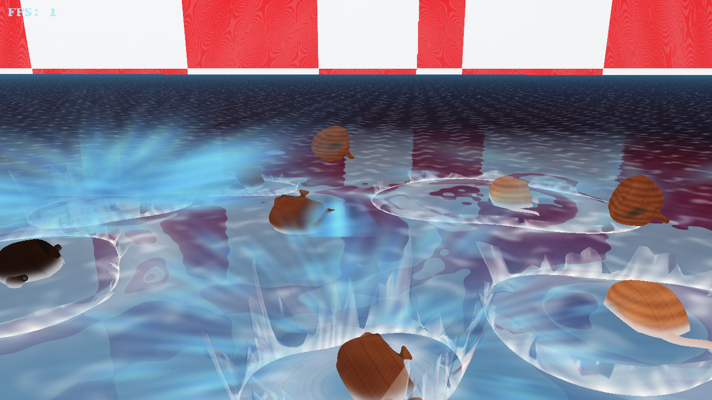
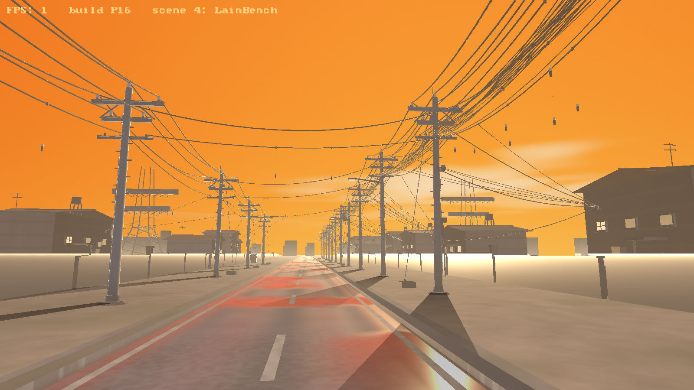
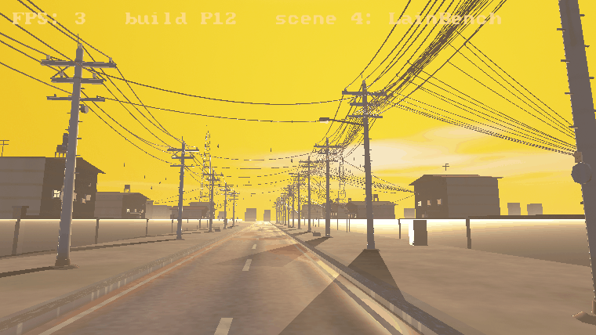

# ElectroBench
ElectroBench is a 45+60+45+45 second long four-scene benchmark specifically designed to run on old and modern PCs.
It uses OpenGL 2.1/3.3, and C++, and uses make for compilation. It is designed to be a replacement for glmark (even though it is great and I used it before).

It ships **one** executable that contains **all four** scenes.

All four scenes present at **1280x720 fullscreen**. Pass `--windowed` to run in a window instead;
fullscreen is suppressed automatically whenever `--screenshot` or `--width` is given.

| Scene | Renderer | Contents |
|---|---|---|
| **Scene 1** (the OG) | OpenGL 2.1 / GLSL 1.2, fixed-function pipeline | **110 UZIs** on a power-trowelled concrete floor under a generated dusk sky, lit by a warm sun, opened by a three-act **flyover camera** (approach, runway pass down the array, pull back) |
| **Scene 2** | OpenGL 3.3 core, pixel-shader workloads | An ocean under volumetric clouds (3DMark2001 SE "Pixel Shader" benchmark recreation) |
| **Scene 3** | OpenGL 3.3 core, analytic shaders | A white-and-red checkerboard-sky pool room lit by a visible luminous ceiling panel (with its own reflection lying down the water), grouted tiles, projected caustics and two waves of falling, splashing teapots (18 total) |
| **Scene 4** | OpenGL 3.3 core, analytic shaders | A utility corridor at amber dusk under a **physically-based atmosphere** (Rayleigh + Mie, limb-darkened sun disc, wind-blown cumulus): weathered **concrete** pole shafts carrying the hardware the reference photograph shows — three tiers of pin insulators, transformer, cut-out fuses, step bolts, guy wires into buried anchors — wrapped in a **dense web of 16 thin slack telecom cables per bay** plus **hanging slack coils and service loops**, two lattice cell masts for scale, a **damp asphalt road with cast concrete kerbs that mirrors the sunset**, houses with lit windows. 4x MSAA |

# System requirements : 

CPU : Any single core CPU @ 500 MHz or more.

RAM : 128MB+

GPU : Technically any GPU that has OpenGL 2.1 support or more, but GPUs that OpenGL 2.1-only will only run scene 1 and the HUD may or may not be available, but any OpenGL 3.3 GPU (2010 GPU onwards) will run it.

OS : Any.


# Screenshots













**In motion - but very slow** — the auto-dolly walking the corridor (four positions down the run): the cable web sweeping overhead pole after pole, slack coils swinging past, guy wires pulling into their anchor blocks, and the telecom bundles peeling off toward the eaves:



# How to build ?

Dependencies : `make`, `g++`, SDL2, GLEW, GLU (+ dev headers). On Debian/Ubuntu that is
`libsdl2-dev libglew-dev libglu1-mesa-dev`; on Windows use MSYS2 (`pacman -S mingw-w64-x86_64-{gcc,SDL2,glew} make`); on macOS `brew install sdl2 glew` (you may need `brew install make` for a GNU make).

```sh
make            # builds the single ElectroBench binary (all four scenes linked in)
make run        # builds it and runs it
```

The one binary lands in `build/` :

```sh
./build/ElectroBench          # Linux / macOS
./build/ElectroBench.exe      # Windows (MSYS2)
```

## Static build

Pass `STATIC=1` to link everything statically (`-static -static-libgcc -static-libstdc++` + static
dependency archives) — handy for dropping a single exe on old machines:

```sh
make STATIC=1            # -> build/ElectroBench-static(.exe)
```

This requires the **static archives** of every dependency (e.g. MSYS2's `mingw-w64-x86_64-SDL2` ships
`libSDL2.a` already; on Linux you need the `.a` variants of SDL2/GLEW/GLU installed). On Windows the
static build also defines `GLEW_STATIC` and uses the static GLEW archive, so its link line is
`-static-libgcc -static-libstdc++ -lopengl32 -lglu32 -lSDL2main -lSDL2 -mwindows` (plus the
`pkg-config --static` dependency flags) — no DLLs are needed next to the exe. The static build keeps
its objects under `build/static/`, separate from the normal DLL-linked objects.

# The OG GL 2.1 benchmark (110 UZIs)

Renders **110 UZIs** (10×11 grid) on a shadow-mapped concrete floor through the fixed-function
pipeline, exactly like a 2001-era title: per-gun compact shadows anchored at each contact point,
a warm directional sun, and a real-time **FPS + score HUD** drawn in a 5×7 bitmap font.

Controls : the camera is a scripted flyover, automatic from launch; `ESC` quits. The FPS counter is a
true frame-count average (SDL performance counter,
every frame accounted) — the on-screen value is a smoothed window, the final score uses **all** frames
of the run.

# Scene 2

**Scene 2** lives in the same ElectroBench binary and is written in **OpenGL 3.3 core**.
It pushes a heavy, realistic ocean workload —
high-resolution environment reflections, a dense displaced ocean mesh, and a real volumetric
light-transport model for the clouds. It is heavy **on purpose**: the goal is to push old and new
hardware, so low single-digit FPS on a low-end machine means the workload is doing its job.

What it renders :
- A procedural **sky dome** rendered **directly at full screen resolution** + wisps...
- A **4 km ocean patch** on a dense GPU-displaced grid.
- High-resolution **environment cubemap** reflections with roughness-matched LOD, frensel... 

Run the ocean scene on its own with :

```sh
make
./build/ElectroBench --scene-only          # Linux / macOS
./build/ElectroBench.exe --scene-only      # Windows (MSYS2)
```

Controls : the fly-over camera is automatic from launch; `ESC` quits.

# Scene 3

**Scene 3** lives in the same ElectroBench binary and is also **OpenGL 3.3 core**. It is the
pool-room illusion: an infinite checkerboard ceiling-sky mirrored perfectly on open water.

What it renders :
- A **checkerboard sky dome**.
- **Open water** with reflections and GGX.
- **Two waves of teapots**: 18 in total
- **Splash FX** (Worthington crown...)

Run the pool scene on its own with :

```sh
make
./build/ElectroBench --pool-only          # Linux / macOS
./build/ElectroBench.exe --pool-only      # Windows (MSYS2)
```

Controls : the fly-over camera is automatic from launch; `ESC` quits. The fleet's fall / return /
resplash loop re-drops itself on its own, no key needed.

# Scene 4:

**Scene 4** lives in the same ElectroBench binary and is also **OpenGL 3.3 core**. The
utility corridor: warm gravel under an amber dusk, two lines of steel poles marching to the
horizon, and a wall of wires over your head.

What it renders :
- **Concrete utility poles**  AAARGHHHHH this is way too much explaining for your tiny brains ANYWAY-

Run the power-lines scene on its own with :

```sh
make
./build/ElectroBench --pole-only          # Linux / macOS
./build/ElectroBench.exe --pole-only      # Windows (MSYS2)
```

Controls : the dolly camera is automatic from launch; `ESC` quits.


- `--screenshot FILE --shot-time S` writes a frame straight out of the
  framebuffer, before the buffer swap. This is what the committed screenshots in
  `docs/screenshots/` were made with, and it cannot come out black.
- `--screenshot FILE --shot-times 6,20,38` writes several frames in one run.


Headless visual-test flags (used to verify the render output in CI-like environments):

```sh
./build/ElectroBench --og-only   --screenshot /tmp/shot.ppm --shot-time 3
./build/ElectroBench --scene-only --width 960 --screenshot /tmp/shot.ppm --shot-times 6,20,38
./build/ElectroBench --pool-only  --width 960 --screenshot /tmp/shot.ppm --shot-times 2,3.2,5,12
./build/ElectroBench --pole-only  --width 960 --screenshot /tmp/shot.ppm --shot-times 2,9
```

# How the score is calculated ?

All scenes use the same formula, computed from the **average FPS over the whole run**:

```
score = fps² × 2
```

It is linear in nothing: twice the frames means twice the score, twice the load means a quarter of
it — a fair curve from office PCs to gaming rigs. The binary prints
`Time / Average FPS / Score` at the end, and the OG scene also shows live FPS + score in its HUD.

# The results screen

When a scene's 45/60 second run ends, **the benchmark clears the window and prints that scene's
score on screen** and leaves it up for a few seconds (the final combined screen for about ten, or until you press `ESC`).
The same line is also printed to stdout.

```sh
Benchmark Results - Time : 45.0s, Average FPS : 12.4, Score : 308
```

# One executable, four scenes

`build/ElectroBench` is the **only** binary, and it contains all four scenes. It runs the OG 60-second gun scene
first, then probes an OpenGL 3.3 core context:

- **found** — the dusk ocean runs as scene 2, then the pool room as scene 3, then the power lines
  as scene 4, on the same session, and the final results screen shows **per-scene scores and the
  average of the scenes that ran**
- **not found** (GL 2.1-only drivers, old iGPUs) — all three GL 3.3 scenes skip themselves cleanly
  and the OG result stands, so the binary still runs on the ancient hardware it targets

Scene selection flags: `--og-only` runs just the gun scene even on GL 3.3-capable devices,
`--scene-only` runs just the ocean scene, `--pool-only` runs just the pool-room scene,
`--pole-only` runs just the power-line scene.

# Windows (MSYS2)

On Windows the easiest route is [MSYS2](https://www.msys2.org/), which provides gcc, cmake and prebuilt SDL2/GLEW/GLU packages. The single binary builds and runs unmodified.

**1. Install MSYS2** from [msys2.org](https://www.msys2.org/) to the default `C:\msys64`.

**2. Run:**

```sh
g++ -std=c++17 -O2\
    src/main.cxx \
    src/scene2.cxx \
    src/scene3.cxx \
    src/scene4.cxx \
    -o build/ElectroBench.exe \
    $(pkg-config --cflags --libs sdl2) \
    -lglew32 \
    -lglu32 \
    -lopengl32
```

(or run `make -j$(nproc)`)

All four scenes are linked into that one binary: `src/scene2.cxx`, `src/scene3.cxx` and
`src/scene4.cxx` are scene modules (they have no `main()` of their own) that `src/main.cxx` hands the
same SDL session to. For
the static build, prefer
`make STATIC=1`: it passes `-DGLEW_STATIC`, uses `pkg-config --static`, and keeps the static object
files separate from the normal build. If invoking `g++` directly, use the same define and static
GLEW archive consistently; do not compile with the DLL-import GLEW header and then link
`libglew32.a`.

- This was verified end-to-end on a Toshiba Satellite P200 and a HP ProBook 430 G6, every scene's shader programs compiled and linked on hardware.

# Contributions

Contributions are welcome, just post a PR / issue.

# Donating

Send me in my email or post an issue : ayoubprogramming96@outlook.com
